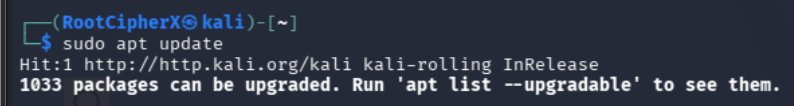
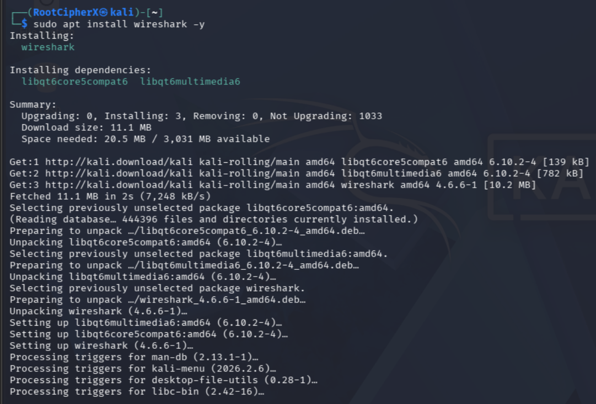
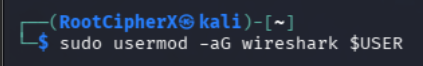
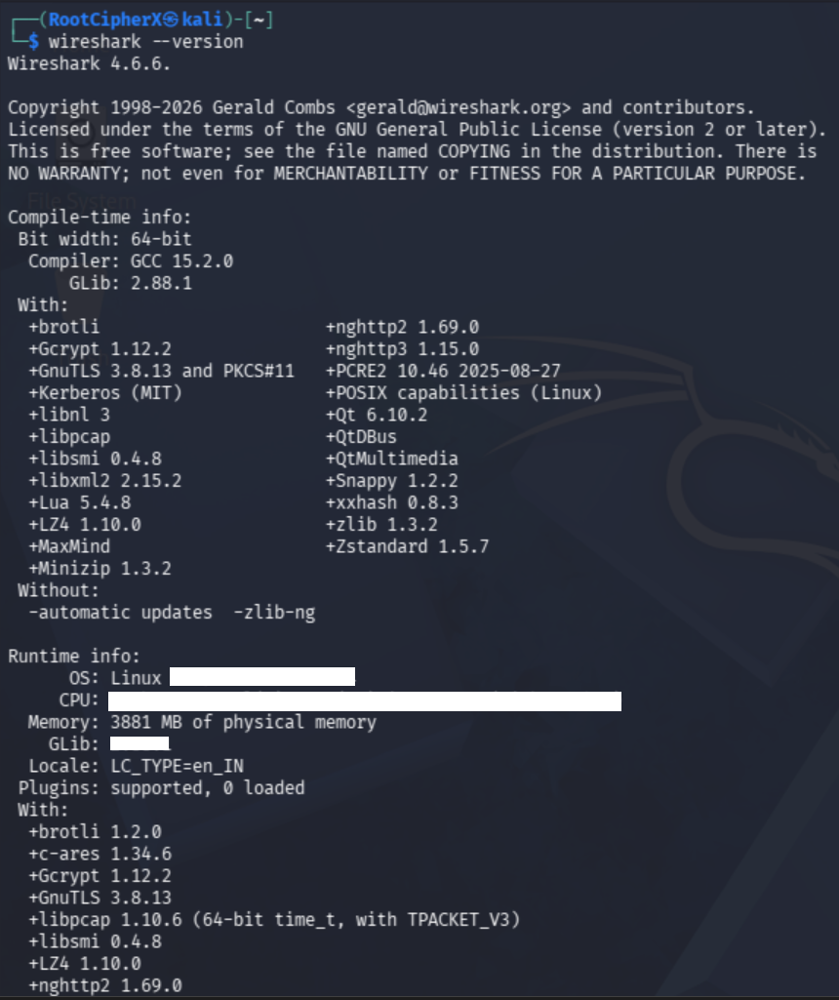

# Cybersecurity: Wireshark Installation & Non-Root Hardening Guide

## Table of Contents
- [Project Overview](#-project-overview)
- [System & Environment Specifications](#️-system--environment-specifications)
- [Implementation & Security Hardening Workflow](#-implementation--security-hardening-workflow)
  - [1. Package Repository Synchronization](#1-package-repository-synchronization)
  - [2. Automated Package Installation & Dependency Management](#2-automated-package-installation--dependency-management)
  - [3. Principle of Least Privilege: Non-Root Packet Capture Setup](#3-principle-of-least-privilege-non-root-packet-capture-setup)
  - [4. Binary & Runtime Environment Verification](#4-binary--runtime-environment-verification)
- [Security Analysis: The Risk of Running Sniffers as Root](#-security-analysis-the-risk-of-running-sniffers-as-root)
- [Ethical Guidelines & Conclusion](#️-ethical-guidelines--conclusion)

---

## Project Overview
This repository documents the installation, dependency resolution, and security-hardened configuration of **Wireshark** on Kali Linux. 

Rather than executing the analyzer with unrestricted root privileges, this implementation enforces the **Principle of Least Privilege (PoLP)** by configuring dedicated Linux user group permissions. This ensures the underlying packet capture engine (`dumpcap`) operates with dedicated capture capabilities while the complex GUI dissectors run in an unprivileged user context.

## 🛠️ System & Environment Specifications
*   **Operating System:** Kali Linux (Kernel `6.19.14+kali-amd64`)
*   **Target User:** `RootCipherX`
*   **Software Version:** Wireshark `4.6.6`
*   **Capture Engine:** `libpcap 1.10.6`
*   **Core Libraries:** `GnuTLS 3.8.13`, `Gcrypt 1.12.2`, `Qt 6.10.2`

---

## Implementation & Security Hardening Workflow

### 1. Package Repository Synchronization
**Objective:** Update local package indexes to guarantee access to the latest security patches and stable package releases.

**Command Executed:**
`sudo apt update`

**Methodology & Observation:**
Synchronized local repository metadata with the official `kali-rolling` repository (`http://kali.org/kali`). The package manager confirmed that the package lists were successfully updated and ready for dependency mapping.

**Result / Evidence:**
 

---

### 2. Automated Package Installation & Dependency Management
**Objective:** Deploy Wireshark along with its necessary Qt6 graphical dependencies in unattended mode.

**Command Executed:**
`sudo apt install wireshark -y`

**Command Breakdown:**
*   `sudo`: Executes the package manager with administrative privileges.
*   `apt install wireshark`: Retrieves the Wireshark metapackage.
*   `-y`: Automatically provides affirmative consent for package installation and dependency configuration.

**Methodology & Observation:**
The package manager successfully resolved and deployed core shared libraries, including `libqt6core5compat6` and `libqt6multimedia6`, before unpacking and configuring Wireshark `4.6.6-1`.

**Result / Evidence:**
 

---

### 3. Principle of Least Privilege: Non-Root Packet Capture Setup
**Objective:** Restrict administrative exposure by granting packet capture rights to a dedicated user group.

**Command Executed:**
`sudo usermod -aG wireshark $USER`

**Command Breakdown:**
*   `usermod`: Modifies the system user account database.
*   `-aG`: Appends (`-a`) the user to the specified supplementary group (`-G`) without removing existing group memberships.
*   `wireshark`: The system security group configured with capabilities to access raw network sockets via `dumpcap`.
*   `$USER`: An environment variable automatically resolving to the active logged-in user (`RootCipherX`).

**Security Relevance:**
Historically, capturing network traffic required full root access. By configuring raw socket privileges via Linux file capabilities on the `dumpcap` binary and adding the user to the `wireshark` group, an analyst can inspect live network traffic without running the massive Wireshark graphical interface as root.

**Result / Evidence:**
 

---

### 4. Binary & Runtime Environment Verification
**Objective:** Validate that the binary is properly linked and check the compiled dissector libraries.

**Command Executed:**
`wireshark --version`

**Methodology & Observation:**
The terminal returned the complete compilation and runtime environment report for Wireshark `4.6.6`. The binary is compiled with support for modern protocol decoders including `brotli`, `nghttp2`, `nghttp3`, `GnuTLS`, and `libpcap 1.10.6`, confirming operational readiness for network analysis.

**Result / Evidence:**
 

---

## Security Analysis: The Risk of Running Sniffers as Root
In enterprise Security Operations Centers (SOCs) and network forensic investigations, running packet analyzers with root privileges is a major security risk:

*   **Vulnerability Surface:** Wireshark contains millions of lines of code and hundreds of protocol dissectors designed to parse untrusted, arbitrary network input.
*   **Memory Corruption Risks:** A malformed packet crafted by an attacker could trigger a buffer overflow or remote code execution (RCE) within a parser.
*   **Privilege Containment:** By isolating capture privileges to `dumpcap` and running the GUI under an unprivileged user account, any potential parser vulnerability remains contained within standard user space, preventing host takeover.

---

## ⚖️ Ethical Guidelines & Conclusion
This installation and security baseline setup establish the foundation for authorized packet sniffing, network troubleshooting, and security monitoring. Packet inspection tools must **only** be deployed on networks and interfaces for which explicit administrative authorization has been granted. Unauthorized eavesdropping or interception of network communications violates data privacy regulations and organizational security policies.
